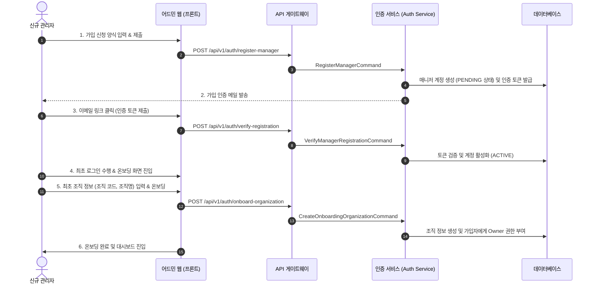

# 관리자 가입 신청 및 조직 온보딩 기능명세서

> [!WARNING]
> 본 문서는 설계 단계의 명세서로, 실제 코드베이스에는 아직 구현되어 있지 않습니다 (구현 예정 사양).

## 1. 개요

본 문서는 플랫폼 진입을 위한 관리자 회원가입 신청, 이메일 기반 가입 검증, 그리고 최초 로그인 후 수행되는 조직(Organization) 온보딩 프로세스의 기능 및 화면 작동 방식을 정의한다.

이 기능은 `origin/feature/manager-registration-onboarding` 브랜치에 구현된 백엔드 API 및 프론트엔드 모듈 사양을 기준으로 작성되었다.

---

## 2. 프로세스 시나리오 흐름도

---

## 3. 화면별 요구사항 및 검증 규칙

### 3.1 관리자 가입 신청 화면 (Register Form)

* **입력 항목**:
  * **이메일**: 필수 입력, 이메일 정규 표준 포맷 검증.
  * **비밀번호**: 필수 입력, 최소 8자 이상, 영문 대소문자/숫자/특수문자 조합 검증.
  * **이름**: 필수 입력, 공백 제외 2자 이상.
  * **휴대폰 번호**: 선택 입력, 하이픈(-) 포함 형식 검규식 검사.
* **입력 검증 (Validation Rules)**:
  * 이미 등록되거나 대기 중인 이메일인 경우 가입 신청이 제한되며, 에러 메시지를 노출한다.
* **제출 후 상태**:
  * 데이터베이스에는 매니저 계정이 `PENDING_VERIFICATION` 상태로 생성된다.
  * 가입 인증용 만료 시간(기본 24시간)이 설정된 보안 토큰이 생성된다.

### 3.2 이메일 인증 화면 (Verification Landing Page)

* **작동 방식**:
  * 사용자가 수신한 가입 승인 메일 내 링크(`https://.../verify?token=XYZ`)를 클릭하여 진입한다.
  * 화면 진입 시 토큰값을 자동으로 파싱하여 검증 API를 호출한다.
* **성공/실패 피드백**:
  * **인증 성공**: "이메일 인증이 완료되었습니다." 안내 문구와 로그인 화면으로의 이동 버튼 노출. 계정 상태는 `ACTIVE`로 변경됨.
  * **인증 실패**: 토큰 만료 또는 존재하지 않는 토큰일 때 "만료되었거나 유효하지 않은 링크입니다." 안내 노출.
  * **인증 메일 재발송**: 인증 실패 또는 링크 유실 시, 로그인 화면에서 "인증 메일 재전송" 버튼을 통해 가입 신청 이메일로 다시 링크를 발송 요청할 수 있음.

### 3.3 조직 온보딩 화면 (Onboarding Dashboard)

* **진입 조건**:
  * `ACTIVE` 상태의 매니저 계정으로 로그인 성공 시, 계정에 연동된 조직(`Organization`)이 없는 경우 메인 대시보드 대신 온보딩 화면으로 강제 리다이렉트된다.
* **입력 항목**:
  * **조직명 (Organization Name)**: 파트너사 또는 기업의 실제 명칭.
  * **조직 코드 (Organization Code)**: 대문자 알파벳, 숫자, 언더스코어(_)만 허용하는 고유 식별 코드 (예: `GOOGLE_KOREA`, `MY_STARTUP_01`).
* **조직 코드 실시간 중복 체크**:
  * 입력된 조직 코드가 전역적으로 중복되었는지 검사하여 중복 시 온보딩 제출을 차단한다.
* **제출 후 처리**:
  * 조직 엔티티 생성.
  * 가입 매니저에게 해당 조직의 최고 관리자(`OWNER`) 역할(Role) 및 권한 그룹 할당.
  * 온보딩 완료 처리가 끝나면 본 어드민 대시보드 화면으로 진입 허용.

---

## 4. API 연동 규격

해당 기능 연동을 위해 게이트웨이 및 인증 마이크로서비스에 매핑되는 API 목록이다.

| API 기능 | Method | Endpoint | DTO Payload / Response |
| :--- | :--- | :--- | :--- |
| **관리자 가입 신청** | `POST` | `/api/v1/auth/register-manager` | **Req**: `RegisterManagerDto` (email, password, name, phone) **Res**: `ApiResponse<RegisterManagerResponseDto>` |
| **가입 이메일 검증** | `POST` | `/api/v1/auth/verify-registration` | **Req**: `VerifyRegistrationDto` (token) **Res**: `ApiResponse<VerifyRegistrationResponseDto>` |
| **인증 메일 재전송** | `POST` | `/api/v1/auth/resend-verification` | **Req**: `ResendVerificationDto` (email) **Res**: `ApiResponse<void>` |
| **조직 온보딩 생성** | `POST` | `/api/v1/auth/onboard-organization` | **Req**: `OnboardOrganizationDto` (name, code) **Res**: `ApiResponse<OrganizationResponseDto>` |

---
*최종 업데이트: 2026-06-07*
