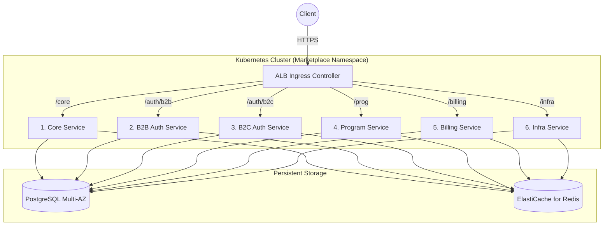
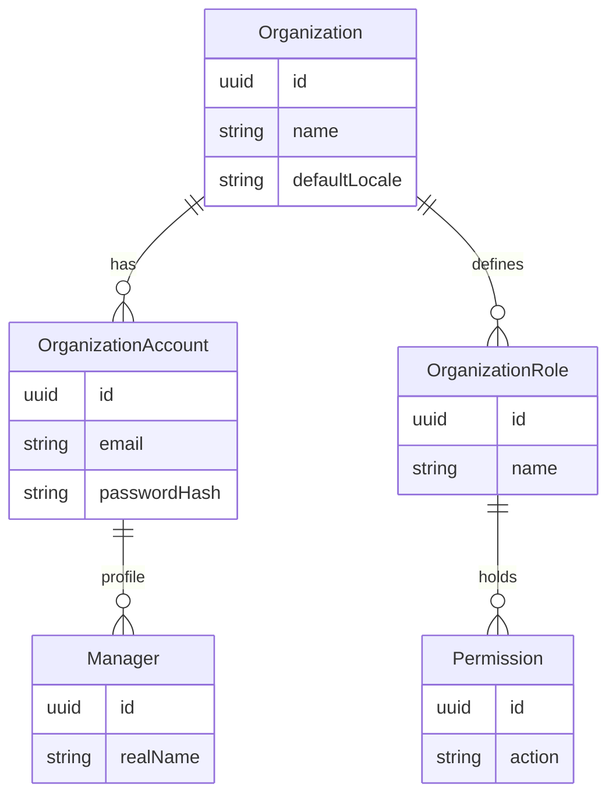
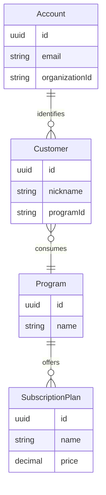
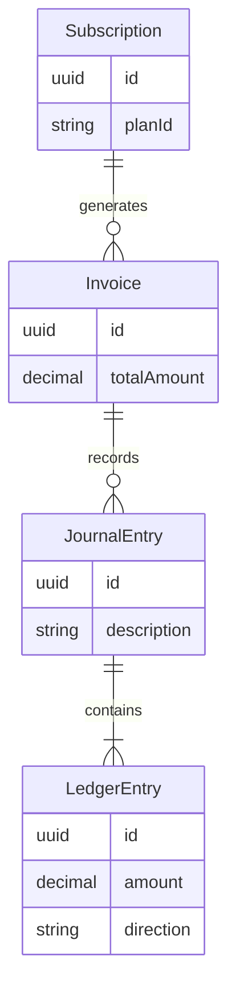

# B2B2C 서비스 마켓플레이스 기획서 (MSA 통합 마스터 플랜)

> **💡 [MASTER SOURCE OF TRUTH] 클린 아키텍처 버전 (v5.1)**
> 본 문서는 B2B2C 아키텍처의 구조적 가독성을 극대화하기 위해 재정비된 마스터 플랜입니다. 복잡한 코드 레벨의 구현체는 배제하고, 핵심 도메인 모델, 토폴로지, 통신 전략을 명확하게 정의합니다.

---

## 📑 목차 (Table of Contents)

1. **[시스템 및 네트워크 아키텍처](#1-시스템-및-네트워크-아키텍처)**
2. **[도메인 모델 구조도 (ERD)](#2-도메인-모델-구조도-erd)**
3. **[마이크로서비스 (MSA) 명세](#3-마이크로서비스-msa-명세)**
4. **[프론트엔드 아키텍처 및 UX 전략](#4-프론트엔드-아키텍처-및-ux-전략)**
5. **[분산 처리 및 메시징 전략](#5-분산-처리-및-메시징-전략)**
6. **[In-Memory 데이터 모델](#6-in-memory-데이터-모델)**

---

## 🏗️ 1. 시스템 및 네트워크 아키텍처

플랫폼은 Kubernetes(EKS) 환경에서 6개의 마이크로서비스로 분리되어 운영되며, AWS ALB를 통한 경로 기반 로드 밸런싱을 수행합니다.

---

## 🗺️ 2. 도메인 모델 구조도 (ERD)

### 2.1. B2B 조직 관리 도메인 (Core)

조직(Organization)과 테넌트 격리를 위한 권한/계정 모델입니다.

### 2.2. B2C 고객 및 상품 도메인 (Identity & Program)

개별 프로그램(Program)과 해당 프로그램을 구독/이용하는 컨슈머 모델입니다.

### 2.3. 재무 및 정산 도메인 (Billing)

정통 복식부기에 기반한 결제 및 원장 관리 모델입니다.

---

## 📦 3. 마이크로서비스 (MSA) 명세

단일 레포지토리(Monorepo) 내에서 6개의 백엔드 서비스로 엄격하게 분리됩니다.

| 서비스명 | 경로 | 핵심 역할 | 도메인 엔터티 |
| :--- | :--- | :--- | :--- |
| **Core Service** | `/core` | 조직, 매니저, 커스텀 RBAC 권한 단일 출처 | `Organization`, `Manager`, `Role` |
| **B2B Auth Service** | `/auth/b2b` | 파트너 앱 매니저 인증, 세션 검증 (단기 토큰) | JWT 발급, B2B 매니저 세션 |
| **B2C Auth Service** | `/auth/b2c` | 소비자 SSO, 대용량 트래픽 최적화 로그인 | `Account`, `Customer` |
| **Program Service** | `/prog` | 비즈니스 상품 카탈로그, 구독 모델 제공 | `Program`, `SubscriptionPlan` |
| **Billing Service** | `/billing` | 결제, 인보이스, 복식부기 원장 엔진 | `Invoice`, `Ledger`, `Subscription` |
| **Infra Service** | `/infra` | 공통 기능 (I18n 다국어, 통합 감사 로그) | `AuditLog`, `Translation` |

---

## 🎨 4. 프론트엔드 아키텍처 및 UX 전략

프론트엔드는 조직 규모와 보안 분리를 위해 극강의 타입 안전성을 제공하는 **TanStack Start** 기반의 2개 B2B 전용 어플리케이션으로 분할 구축됩니다. (B2C 소비자 웹은 타 레포지토리 격리)

* **`apps/admin-web`**: 마켓플레이스 운영진(Super Admin)을 위한 대시보드. 재무 정산, 테넌트 승인 기능.
* **`apps/partner-web`**: 플랫폼 입점 파트너(Organization)용 매니저 웹. 고객 관리, 프로그램 설정 제어.
* **White-labeling UI**: 로그인 시 해당 테넌트의 메타데이터를 Server Loader 레이어에서 안전하게 Fetch하여, 실시간 테마 컬러와 다국어(I18n) 용어 세팅을 SSR 단계에서 깜빡임 없이 오버라이딩합니다.

---

## 🔄 5. 분산 처리 및 메시징 전략

데이터 무손실 100% 달성과 마이크로서비스 간 정합성을 유지하기 위해 비동기 3대 핵심 패턴을 채택합니다.

1. **Transactional Outbox 패턴**: 데이터베이스 트랜잭션과 동일한 범위에 이벤트(`OutboxEvent`)를 저장 후, Message Relay Worker가 이벤트를 Broker(RabbitMQ)로 전송합니다. 이벤트 누락을 원천 차단합니다.
2. **Saga 보상 트랜잭션 (Choreography)**:
    * (Flow): `구독 발생(Program)` ➡️ `결제 분개(Billing)` ➡️ `권한 부여(Core)`.
    * 중간 단계(예: 결제 잔액 부족) 실패 시 역방향으로 이벤트를 발행하여 기존 구독을 취소하는 보상 트랜잭션을 강제합니다.
3. **복식부기 (Double-Entry Ledger)**: `Billing` 서비스에서 모든 금전 흐름은 반드시 차변과 대변의 교차 기록이 일치해야만 최종 승인됩니다.

---

## ⚡ 6. In-Memory 데이터 모델

ElastiCache(Redis)를 활용하여 MSA 통신에 따른 병목과 인증 부하를 제거합니다.

* **B2B / B2C 캐싱 분리**:
  * `session:b2b:org:{id}:mgr:{id}` (강력한 보안, 즉시 무효화 목적)
  * `session:b2c:prog:{id}:cust:{id}` (트래픽 스파이크 대응, 긴 TTL)
* **인가 토큰 오프로딩**:
  * `cache:role:{id}:perms`: 권한 체계를 Redis에 캐싱하여 Core 서비스의 DB Hit Ratio를 낮춥니다.
  * `ratelimit:{ip}:route`: 백엔드 방어용 Rate Limiting 정책 적용.

---
*본 문서는 6개 마이크로서비스 및 백엔드 개발(Monorepo)을 위한 절대적인 나침반 역할을 수행함과 동시에, 글로벌 규제 준수(Data Residency), 지구 환경(Green IT), 그리고 무중단 생존 전략(Cross-Cloud)을 모두 아우르는 초거대 비즈니스 마켓플레이스의 바이블입니다.*
